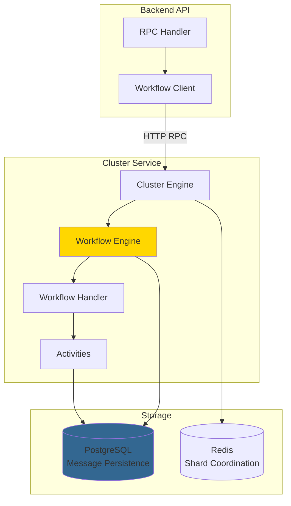

## Overview

Hazel Chat uses **Effect Cluster** and **Effect Workflow** for distributed background job processing. This provides:

- **Durable execution** - workflows survive restarts
- **Idempotency** - safe to retry operations
- **Scalability** - distributed across multiple nodes
- **Observability** - structured logging and tracing
- **Type safety** - fully typed with Effect-TS

<Info>
Effect Workflow is like Temporal or AWS Step Functions, but built on Effect-TS with full type safety and composability.
</Info>

## Architecture



## Cluster Service Setup

### Server Configuration

```typescript
// apps/cluster/src/index.ts
import { ClusterWorkflowEngine } from "@effect/cluster"
import { BunClusterSocket } from "@effect/platform-bun"
import { PgClient } from "@effect/sql-pg"
import { WorkflowProxyServer } from "@effect/workflow"
import { Config, Layer } from "effect"

// PostgreSQL-backed workflow engine
const WorkflowEngineLayer = ClusterWorkflowEngine.layer.pipe(
  Layer.provideMerge(BunClusterSocket.layer()),
  Layer.provideMerge(
    PgClient.layerConfig({
      url: Config.redacted("EFFECT_DATABASE_URL"),
    }),
  ),
)

// Workflow HTTP API
const WorkflowApiLive = HttpApiBuilder.api(Cluster.WorkflowApi).pipe(
  Layer.provide(
    WorkflowProxyServer.layerHttpApi(
      Cluster.WorkflowApi,
      "workflows",
      Cluster.workflows,
    ),
  ),
)

// Start server
Layer.launch(
  ServerLayer.pipe(
    Layer.provide(WorkflowEngineLayer),
  ),
).pipe(BunRuntime.runMain)
```

**Key components:**
- `ClusterWorkflowEngine` - Manages workflow execution
- `BunClusterSocket` - Shard coordination via WebSocket
- `PgClient` - PostgreSQL for message persistence
- `WorkflowProxyServer` - HTTP API for triggering workflows

<Note>
The cluster service runs on port **3020** by default.
</Note>

## Workflow Definitions

Workflows are defined in `packages/domain/src/cluster/workflows/` and shared between backend and cluster service.

### Defining a Workflow

```typescript
// packages/domain/src/cluster/workflows/message-notification-workflow.ts
import { Workflow } from "@effect/workflow"
import { ChannelId, MessageId, UserId } from "@hazel/schema"
import { Schema } from "effect"
import { ChannelType } from "../../models/channel-model"

export const MessageNotificationWorkflow = Workflow.make({
  name: "MessageNotificationWorkflow",
  payload: {
    messageId: MessageId,
    channelId: ChannelId,
    authorId: UserId,
    channelType: ChannelType,
    content: Schema.String,
    replyToMessageId: Schema.NullOr(MessageId),
  },
  error: MessageNotificationWorkflowError,
  // Process each message only once
  idempotencyKey: (payload) => payload.messageId,
})

export type MessageNotificationWorkflowPayload = Schema.Schema.Type<
  typeof MessageNotificationWorkflow.payloadSchema
>
```

**Key options:**
- `name` - Unique workflow identifier
- `payload` - Input schema (validated automatically)
- `error` - Error schema for failures
- `idempotencyKey` - Function to extract idempotency key

### Activity Schemas

Activities represent individual steps in a workflow:

```typescript
// packages/domain/src/cluster/activities/message-activities.ts
import { Schema } from "effect"
import type { ChannelMemberId } from "@hazel/schema"

export const ChannelMemberForNotification = Schema.Struct({
  id: Schema.String,
  channelId: Schema.String,
  userId: Schema.String,
  isMuted: Schema.Boolean,
  notificationCount: Schema.Number,
})

export const GetChannelMembersResult = Schema.Struct({
  members: Schema.Array(ChannelMemberForNotification),
  totalCount: Schema.Number,
})

export class GetChannelMembersError extends Schema.TaggedError<GetChannelMembersError>()("GetChannelMembersError", {
  channelId: Schema.String,
  message: Schema.String,
  cause: Schema.Unknown,
  retryable: Schema.Boolean.pipe(Schema.withDefault(() => true)),
}) {}

export const CreateNotificationsResult = Schema.Struct({
  notificationIds: Schema.Array(Schema.String),
  notifiedCount: Schema.Number,
})

export class CreateNotificationError extends Schema.TaggedError<CreateNotificationError>()("CreateNotificationError", {
  messageId: Schema.String,
  message: Schema.String,
  cause: Schema.Unknown,
  retryable: Schema.Boolean.pipe(Schema.withDefault(() => true)),
}) {}
```

## Workflow Implementation

### Implementing the Workflow

```typescript
// apps/cluster/src/workflows/message-notification-handler.ts
import { Activity } from "@effect/workflow"
import { Database, schema, eq, and, inArray } from "@hazel/db"
import { Cluster } from "@hazel/domain"
import { Effect } from "effect"

export const MessageNotificationWorkflowLayer = 
  Cluster.MessageNotificationWorkflow.toLayer(
    Effect.fn(function* (payload: Cluster.MessageNotificationWorkflowPayload) {
      yield* Effect.logDebug(
        `Starting MessageNotificationWorkflow for message ${payload.messageId}`,
      )
      
      // Activity 1: Get channel members to notify
      const membersResult = yield* Activity.make({
        name: "GetChannelMembers",
        success: Cluster.GetChannelMembersResult,
        error: Cluster.GetChannelMembersError,
        execute: Effect.gen(function* () {
          const db = yield* Database
          
          // Query eligible members
          const channelMembers = yield* db
            .execute((client) =>
              client
                .select({
                  id: schema.channelMembersTable.id,
                  channelId: schema.channelMembersTable.channelId,
                  userId: schema.channelMembersTable.userId,
                  isMuted: schema.channelMembersTable.isMuted,
                  notificationCount: schema.channelMembersTable.notificationCount,
                })
                .from(schema.channelMembersTable)
                .where(
                  and(
                    eq(schema.channelMembersTable.channelId, payload.channelId),
                    eq(schema.channelMembersTable.isMuted, false),
                    ne(schema.channelMembersTable.userId, payload.authorId),
                  ),
                ),
            )
            .pipe(
              Effect.catchTags({
                DatabaseError: (err) =>
                  Effect.fail(
                    new Cluster.GetChannelMembersError({
                      channelId: payload.channelId,
                      message: "Failed to query channel members",
                      cause: err,
                    }),
                  ),
              }),
            )
          
          return {
            members: channelMembers,
            totalCount: channelMembers.length,
          }
        }),
      })
      
      // If no members to notify, we're done
      if (membersResult.totalCount === 0) {
        yield* Effect.logDebug("No members to notify, workflow complete")
        return
      }
      
      // Activity 2: Create notifications
      const notificationsResult = yield* Activity.make({
        name: "CreateNotifications",
        success: Cluster.CreateNotificationsResult,
        error: Cluster.CreateNotificationError,
        execute: Effect.gen(function* () {
          const db = yield* Database
          
          // Build notification rows
          const values = membersResult.members.map((member) => ({
            memberId: member.orgMemberId,
            targetedResourceId: payload.channelId,
            targetedResourceType: "channel" as const,
            resourceId: payload.messageId,
            resourceType: "message" as const,
            createdAt: new Date(),
          }))
          
          // Insert notifications
          const inserted = yield* db
            .execute((client) =>
              client
                .insert(schema.notificationsTable)
                .values(values)
                .onConflictDoNothing()
                .returning({ id: schema.notificationsTable.id }),
            )
            .pipe(
              Effect.catchTags({
                DatabaseError: (err) =>
                  Effect.fail(
                    new Cluster.CreateNotificationError({
                      messageId: payload.messageId,
                      message: "Failed to insert notifications",
                      cause: err,
                    }),
                  ),
              }),
            )
          
          return {
            notificationIds: inserted.map((row) => row.id),
            notifiedCount: inserted.length,
          }
        }),
      })
      
      yield* Effect.logDebug(
        `MessageNotificationWorkflow completed: ${notificationsResult.notifiedCount} notifications created`,
      )
    }),
  )
```

**Key patterns:**
- Use `Activity.make()` for each step
- Always provide `success` and `error` schemas
- Activities can access services via `yield*`
- Errors are automatically retried based on `retryable` flag

### Registering Workflows

```typescript
// apps/cluster/src/index.ts
import {
  MessageNotificationWorkflowLayer,
  CleanupUploadsWorkflowLayer,
  GitHubWebhookWorkflowLayer,
} from "./workflows"

const AllWorkflows = Layer.mergeAll(
  MessageNotificationWorkflowLayer,
  CleanupUploadsWorkflowLayer,
  GitHubWebhookWorkflowLayer,
).pipe(Layer.provide(DatabaseLayer))
```

<CardGroup cols={2}>
  <Card title="Durability" icon="shield">
    Workflow state is persisted in PostgreSQL - survives restarts
  </Card>
  <Card title="Idempotency" icon="repeat">
    Workflows can be safely retried using idempotency keys
  </Card>
</CardGroup>

## Triggering Workflows

### From Backend Code

```typescript
// apps/backend/src/rpc/messages.ts
import { Effect } from "effect"
import { WorkflowClient } from "@hazel/cluster"
import { Cluster } from "@hazel/domain"

export const messageCreateHandler = Rpc.effect(
  MessageRpcs.messageCreate,
  (payload) =>
    Effect.gen(function* () {
      const messageRepo = yield* MessageRepo
      const db = yield* Database
      const workflowClient = yield* WorkflowClient
      
      // Create message in transaction
      const result = yield* db.transaction(
        Effect.gen(function* () {
          const message = yield* messageRepo.insert(payload)
          const txId = yield* generateTransactionId()
          return { data: message, transactionId: txId }
        }),
      )
      
      // Trigger workflow asynchronously (fire and forget)
      yield* workflowClient.workflows.MessageNotificationWorkflow.execute({
        id: result.data.id,  // Execution ID (for idempotency)
        messageId: result.data.id,
        channelId: result.data.channelId,
        authorId: result.data.authorId,
        channelType: channel.type,
        content: result.data.content,
        replyToMessageId: result.data.replyToMessageId,
      }).pipe(
        Effect.fork,  // Don't wait for workflow to complete
        Effect.catchAllCause(() => Effect.void),  // Log errors but don't fail
      )
      
      return result
    }),
)
```

### Via HTTP API

Workflows can also be triggered via HTTP:

```bash
curl -X POST http://localhost:3020/workflows/MessageNotificationWorkflow/execute \
  -H "Content-Type: application/json" \
  -d '{
    "id": "msg-123",
    "messageId": "msg-123",
    "channelId": "chan-456",
    "authorId": "user-789",
    "channelType": "public",
    "content": "Hello world",
    "replyToMessageId": null
  }'
```

<Info>
The `id` field is the **execution ID** used for idempotency. Using the same ID will not create duplicate executions.
</Info>

## Example Workflows

### Message Notification Workflow

**Purpose:** Creates notifications for new messages based on channel type and mentions.

**Trigger:** After creating a message

**Activities:**
1. `GetChannelMembers` - Query eligible members
2. `CreateNotifications` - Batch insert notifications

**Logic:**
- DM/group chats → notify all members
- Regular channels → notify only mentioned users or reply-to author
- Respect mute settings and presence status

### Cleanup Uploads Workflow

**Purpose:** Removes unused file uploads from S3.

**Trigger:** Scheduled cron job (daily)

**Activities:**
1. `FindOrphanedUploads` - Query uploads not linked to messages
2. `DeleteFromS3` - Remove files from object storage
3. `DeleteUploadRecords` - Clean up database records

### GitHub Webhook Workflow

**Purpose:** Processes GitHub webhook events (issues, PRs, etc.).

**Trigger:** Incoming webhook from GitHub

**Activities:**
1. `ParseWebhook` - Extract event data
2. `FindSubscriptions` - Find channels subscribed to this repo
3. `PostMessages` - Create messages in subscribed channels

### RSS Feed Poll Workflow

**Purpose:** Polls RSS feeds and posts new items to channels.

**Trigger:** Scheduled cron job (every 5 minutes)

**Activities:**
1. `FetchFeed` - Download and parse RSS feed
2. `FindNewItems` - Compare with last poll
3. `PostFeedItems` - Create messages for new items

## Workflow Client

### Client Setup

```typescript
// packages/backend-core/src/workflow-client.ts
import { WorkflowClient } from "@effect/workflow"
import { HttpClient } from "@effect/platform"
import { Cluster } from "@hazel/domain"
import { Effect, Layer, Config } from "effect"

export const WorkflowClientLive = Layer.unwrapEffect(
  Effect.gen(function* () {
    const clusterUrl = yield* Config.string("CLUSTER_URL")
    const httpClient = yield* HttpClient.HttpClient
    
    return WorkflowClient.layer({
      workflows: Cluster.workflows,
      http: httpClient.pipe(
        HttpClient.mapRequest(
          HttpClientRequest.prependUrl(clusterUrl),
        ),
      ),
    })
  }),
)
```

### Using the Client

```typescript
import { Effect } from "effect"
import { WorkflowClient } from "@hazel/backend-core"

const triggerWorkflow = Effect.gen(function* () {
  const client = yield* WorkflowClient
  
  // Execute workflow and wait for result
  const result = yield* client.workflows.MessageNotificationWorkflow.execute({
    id: messageId,
    messageId,
    channelId,
    authorId,
    channelType: "public",
    content: "Hello",
    replyToMessageId: null,
  })
  
  return result
})

// Execute workflow but don't wait (fire and forget)
const triggerAsync = triggerWorkflow.pipe(
  Effect.fork,
  Effect.catchAllCause(() => Effect.void),
)
```

## Cron Jobs

Scheduled workflows using Effect Cluster's cron system:

```typescript
// apps/cluster/src/cron/rss-poll-cron.ts
import { ClusterCron } from "@effect/cluster"
import { Schedule } from "effect"
import { WorkflowClient } from "@hazel/backend-core"
import { Cluster } from "@hazel/domain"

export const RssPollCronLayer = ClusterCron.layer({
  name: "RssPollCron",
  schedule: Schedule.fixed("5 minutes"),
  effect: Effect.gen(function* () {
    const db = yield* Database
    const client = yield* WorkflowClient
    
    // Get all RSS subscriptions
    const subscriptions = yield* db.execute((client) =>
      client.select().from(schema.rssSubscriptionsTable),
    )
    
    // Trigger workflow for each subscription
    yield* Effect.forEach(
      subscriptions,
      (sub) =>
        client.workflows.RssFeedPollWorkflow.execute({
          id: `rss-${sub.id}-${Date.now()}`,
          subscriptionId: sub.id,
          feedUrl: sub.feedUrl,
          channelId: sub.channelId,
        }).pipe(Effect.fork),
      { concurrency: 5 },
    )
  }),
})
```

## Error Handling & Retries

### Retryable Errors

Mark errors as retryable:

```typescript
export class GetChannelMembersError extends Schema.TaggedError<GetChannelMembersError>()("GetChannelMembersError", {
  channelId: Schema.String,
  message: Schema.String,
  cause: Schema.Unknown,
  retryable: Schema.Boolean.pipe(Schema.withDefault(() => true)),  // Retry by default
}) {}
```

### Manual Retry Logic

```typescript
const activityWithRetry = yield* Activity.make({
  name: "FetchData",
  success: DataSchema,
  error: FetchError,
  execute: Effect.gen(function* () {
    return yield* fetchData().pipe(
      Effect.retry(Schedule.exponential("1 second").pipe(
        Schedule.compose(Schedule.recurs(3)),
      )),
    )
  }),
})
```

## Testing Workflows

### Mock Workflow Client

```typescript
import { Effect, Layer } from "effect"
import { WorkflowClient } from "@hazel/backend-core"

const WorkflowClientMock = Layer.succeed(WorkflowClient, {
  workflows: {
    MessageNotificationWorkflow: {
      execute: (payload) =>
        Effect.succeed({ notifiedCount: 5 }),
    },
  },
})

// Use in tests
const testProgram = program.pipe(Layer.provide(WorkflowClientMock))
```

## Best Practices

<CardGroup cols={2}>
  <Card title="Idempotency Keys" icon="key">
    Always provide idempotency keys to prevent duplicate executions
  </Card>
  <Card title="Activity Schemas" icon="shield-check">
    Define schemas for activity inputs and outputs
  </Card>
  <Card title="Error Types" icon="triangle-exclamation">
    Mark errors as retryable or non-retryable appropriately
  </Card>
  <Card title="Fire and Forget" icon="rocket">
    Use `Effect.fork` to trigger workflows without blocking
  </Card>
  <Card title="Logging" icon="file-lines">
    Log workflow progress for observability
  </Card>
  <Card title="Database Access" icon="database">
    Access database in activities, not in workflow logic
  </Card>
</CardGroup>

## Monitoring

### Workflow Status

Check workflow execution status:

```bash
curl http://localhost:3020/workflows/MessageNotificationWorkflow/status/msg-123
```

### Logs

Workflow logs are structured and include:
- Execution ID
- Activity name
- Duration
- Error details (if failed)

<Info>
Use OpenTelemetry integration for distributed tracing across workflows and activities.
</Info>

## Next Steps

<CardGroup cols={2}>
  <Card title="Effect-TS Patterns" icon="wand-magic-sparkles" href="/architecture/effect-ts">
    Learn more about Effect-TS patterns
  </Card>
  <Card title="RPC System" icon="code" href="/architecture/rpc-system">
    Understand the RPC system for triggering workflows
  </Card>
</CardGroup>