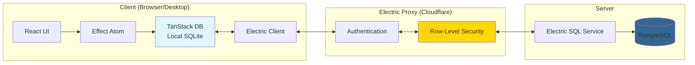

## Overview

Hazel Chat uses **Electric SQL** for local-first data synchronization. This architecture provides:

- **Instant UI updates** with optimistic rendering
- **Offline support** with automatic sync when reconnected
- **Real-time collaboration** with millisecond-latency updates
- **Reduced server load** by handling reads locally

<Info>
Electric SQL streams database changes from PostgreSQL to clients using HTTP long-polling, keeping local SQLite databases in sync.
</Info>

## Architecture



## Data Flow

### Write Flow (Client → Server)

1. **User action** triggers RPC call via Effect RPC
2. **Backend API** validates and writes to PostgreSQL
3. **Transaction ID** returned for optimistic updates
4. **Electric SQL** detects change via PostgreSQL logical replication
5. **Electric broadcasts** change to all subscribed clients
6. **TanStack DB** updates local SQLite database
7. **React components** re-render with new data

### Read Flow (Local-First)

1. **React component** queries data via Effect Atom
2. **TanStack DB** reads from local SQLite (instant)
3. **No network request** needed for most queries
4. **Background sync** keeps local data fresh

<Note>
Most read operations never touch the network - data is served from local SQLite for instant responsiveness.
</Note>

## TanStack DB Integration

### Collection Definition

Collections define how Electric SQL shapes are stored in TanStack DB:

```typescript
// apps/web/src/db/collections.ts
import { createEffectCollection } from "effect-electric-db-collection"
import { Message } from "@hazel/domain/models"
import { runtime } from "~/lib/services/common/runtime"

const electricUrl: string = import.meta.env.VITE_ELECTRIC_URL

export const messageCollection = createEffectCollection({
  id: "messages",
  runtime: runtime,
  backoff: false,  // Retry handled at fetch level
  shapeOptions: {
    url: electricUrl,
    params: {
      table: "messages",
    },
    parser: {
      timestamptz: (date: string) => new Date(date),
    },
    fetchClient: electricFetchClient,
  },
  schema: Message.Model.json,
  getKey: (item) => item.id,
})
```

**Key options:**
- `id` - Unique collection identifier
- `runtime` - Effect runtime for executing effects
- `shapeOptions.table` - PostgreSQL table name
- `schema` - Effect Schema for validation
- `getKey` - Function to extract unique key

### Querying Collections

Query collections using TanStack DB atoms:

```typescript
import { messageCollection } from "~/db/collections"
import { Atom } from "@effect-atom/atom-react"
import { TDB } from "effect-electric-db-collection"

// Query messages for a channel
const channelMessagesAtom = Atom.make((get) => {
  const channelId = get(currentChannelAtom)
  
  return get.result(TDB.query(messageCollection, (db) =>
    db
      .where("channelId", "=", channelId)
      .orderBy("createdAt", "desc")
      .limit(50)
  ))
})

// Use in React component
function MessageList() {
  const messagesResult = useAtomValue(channelMessagesAtom)
  
  if (Result.isLoading(messagesResult)) {
    return <LoadingSpinner />
  }
  
  if (Result.isError(messagesResult)) {
    return <ErrorMessage error={messagesResult.error} />
  }
  
  return (
    <div>
      {messagesResult.value.map((message) => (
        <MessageItem key={message.id} message={message} />
      ))}
    </div>
  )
}
```

<CardGroup cols={2}>
  <Card title="Local-First" icon="database">
    Queries execute against local SQLite - no network latency
  </Card>
  <Card title="Reactive" icon="arrows-rotate">
    Components auto-update when data changes
  </Card>
</CardGroup>

## Electric SQL Proxy

The Electric proxy enforces authorization and row-level security.

### Proxy Architecture

```typescript
// apps/electric-proxy/src/index.ts
import { authenticateRequest } from "./auth"
import { getWhereClauseForTable } from "./tables/user-tables"

export default {
  async fetch(request: Request, env: Env): Promise<Response> {
    // 1. Authenticate the request
    const authResult = await authenticateRequest(request, env)
    if (!authResult.authenticated) {
      return new Response("Unauthorized", { status: 401 })
    }
    
    const userId = authResult.userId
    const url = new URL(request.url)
    const table = url.searchParams.get("table")
    
    // 2. Check if table is allowed
    if (!ALLOWED_TABLES.includes(table)) {
      return new Response("Forbidden", { status: 403 })
    }
    
    // 3. Build WHERE clause for row-level security
    const whereClause = await getWhereClauseForTable(table, userId, env)
    if (!whereClause) {
      return new Response("Forbidden", { status: 403 })
    }
    
    // 4. Forward to Electric SQL with WHERE clause
    const electricUrl = new URL(env.ELECTRIC_URL)
    electricUrl.searchParams.set("table", table)
    electricUrl.searchParams.set("where", whereClause)
    
    return fetch(electricUrl.toString(), {
      headers: request.headers,
    })
  },
}
```

### Row-Level Security

The proxy injects WHERE clauses based on user permissions:

```typescript
// apps/electric-proxy/src/tables/user-tables.ts
export async function getWhereClauseForTable(
  table: string,
  userId: UserId,
  env: Env,
): Promise<string | null> {
  return Match.value(table).pipe(
    // Organization membership check
    Match.when("organizations", () =>
      buildOrgMembershipClause(userId, env)
    ),
    
    // Channel access check
    Match.when("messages", () =>
      buildChannelAccessClause(userId, env)
    ),
    Match.when("channels", () =>
      buildChannelAccessClause(userId, env)
    ),
    
    // User-scoped data
    Match.when("users", () =>
      Effect.succeed(`id = '${userId}'`)
    ),
    
    // Deny by default
    Match.orElse(() => Effect.succeed(null)),
  )
}

// Build WHERE clause for organization membership
const buildOrgMembershipClause = (userId: UserId, env: Env) =>
  Effect.gen(function* () {
    const db = yield* Database
    
    const orgs = yield* db.execute((client) =>
      client
        .select({ orgId: schema.organizationMembersTable.organizationId })
        .from(schema.organizationMembersTable)
        .where(eq(schema.organizationMembersTable.userId, userId))
    )
    
    const orgIds = orgs.map((row) => row.orgId)
    return `id IN (${orgIds.map((id) => `'${id}'`).join(",")})`
  })
```

<Info>
**Important:** When adding a new Electric-synced table, you must:
1. Add the table to `ALLOWED_TABLES`
2. Add a `Match.when` case in `getWhereClauseForTable`
</Info>

## Optimistic Updates

### Transaction IDs

The backend returns transaction IDs for optimistic updates:

```typescript
import { generateTransactionId } from "@hazel/db"

// Backend RPC handler
export const messageCreate = Rpc.effect(
  Rpc.Messages.MessageCreate,
  (payload) =>
    Effect.gen(function* () {
      const db = yield* Database
      
      return yield* db.transaction(
        Effect.gen(function* () {
          const message = yield* MessageRepo.insert(payload)
          const txId = yield* generateTransactionId()
          
          return { data: message, transactionId: txId }
        }),
      )
    }),
)
```

### Frontend Optimistic Updates

```typescript
import { Atom } from "@effect-atom/atom-react"
import { RpcClient } from "~/lib/rpc-client"

const sendMessage = (content: string) =>
  Atom.fn(function* (ctx) {
    const channelId = yield* ctx.get(currentChannelAtom)
    const currentUser = yield* ctx.get(currentUserAtom)
    const rpc = yield* RpcClient
    
    // Generate temporary ID for optimistic update
    const tempId = `temp-${Date.now()}`
    const optimisticMessage = {
      id: tempId,
      channelId,
      content,
      authorId: currentUser.id,
      createdAt: new Date(),
    }
    
    // Add to local store immediately
    yield* ctx.set(TDB.insert(messageCollection, optimisticMessage))
    
    // Send to server
    const result = yield* rpc.messageCreate({ channelId, content })
    
    // Replace temp message with real one when sync arrives
    // (Electric SQL will handle this automatically)
  })
```

## Sync Modes

Collections support different sync modes:

### Eager Sync (Default)

```typescript
export const messageCollection = createEffectCollection({
  id: "messages",
  // syncMode: "eager",  // Default - start syncing immediately
  // ...
})
```

Starts syncing as soon as the collection is created.

### On-Demand Sync

```typescript
export const notificationCollection = createEffectCollection({
  id: "notifications",
  syncMode: "on-demand",  // Don't sync until explicitly requested
  // ...
})
```

Delays syncing until the collection is first queried.

### Progressive Sync

```typescript
export const userCollection = createEffectCollection({
  id: "users",
  syncMode: "progressive",  // Load in batches
  // ...
})
```

Loads data in progressive batches for large datasets.

<CardGroup cols={3}>
  <Card title="Eager" icon="bolt">
    Best for: Small, frequently accessed data
  </Card>
  <Card title="On-Demand" icon="hand">
    Best for: Large, infrequently accessed data
  </Card>
  <Card title="Progressive" icon="bars-progress">
    Best for: Very large datasets needing pagination
  </Card>
</CardGroup>

## Conflict Resolution

Electric SQL uses **last-write-wins** conflict resolution:

1. Each write gets a timestamp from PostgreSQL
2. Concurrent writes are ordered by timestamp
3. Later writes override earlier writes
4. Clients receive updates in timestamp order

<Note>
For most use cases, last-write-wins is sufficient. For complex conflict resolution, handle it in the backend before writing to PostgreSQL.
</Note>

## Offline Support

### How Offline Works

1. **User goes offline** - TanStack DB continues serving queries from local SQLite
2. **Mutations queued** - RPC calls fail and can be retried
3. **User comes back online** - Electric SQL resumes sync
4. **Background sync** - Local database catches up with server changes

### Detecting Online Status

```typescript
import { Atom } from "@effect-atom/atom-react"

const isOnlineAtom = Atom.make(() => navigator.onLine).pipe(
  Atom.keepAlive,
)

// Update on network events
window.addEventListener("online", () => {
  Atom.set(isOnlineAtom, true)
})

window.addEventListener("offline", () => {
  Atom.set(isOnlineAtom, false)
})

// Use in components
function NetworkStatus() {
  const isOnline = useAtomValue(isOnlineAtom)
  
  if (!isOnline) {
    return <Banner>You are offline. Changes will sync when reconnected.</Banner>
  }
  
  return null
}
```

## Performance Optimization

### Limiting Data Volume

Use WHERE clauses to reduce synced data:

```typescript
// Only sync messages from the last 30 days
export const messageCollection = createEffectCollection({
  id: "messages",
  shapeOptions: {
    url: electricUrl,
    params: {
      table: "messages",
      where: `created_at > NOW() - INTERVAL '30 days'`,
    },
  },
  // ...
})
```

### Selective Syncing

Only create collections for data the user needs:

```typescript
import { Atom } from "@effect-atom/atom-react"
import { TDB } from "effect-electric-db-collection"

// Create collection only for current organization
const orgChannelsCollectionAtom = Atom.make((get) => {
  const orgId = get(currentOrgAtom)
  
  return createEffectCollection({
    id: `org-${orgId}-channels`,
    shapeOptions: {
      params: {
        table: "channels",
        where: `organization_id = '${orgId}'`,
      },
    },
    // ...
  })
})
```

## Debugging

### Electric SQL Logs

Enable debug logs in the Electric client:

```typescript
import { ElectricClient } from "electric-sql"

const electric = new ElectricClient({
  url: electricUrl,
  debug: true,  // Enable debug logging
})
```

### TanStack DB DevTools

Use TanStack DB DevTools to inspect local database:

```typescript
import { TanStackDBDevtools } from "@tanstack/db-devtools"

function App() {
  return (
    <>
      <YourApp />
      {import.meta.env.DEV && <TanStackDBDevtools />}
    </>
  )
}
```

## Best Practices

<CardGroup cols={2}>
  <Card title="Minimize Sync Volume" icon="filter">
    Use WHERE clauses to sync only what users need
  </Card>
  <Card title="Update Proxy Rules" icon="shield">
    Always update Electric proxy when adding new tables
  </Card>
  <Card title="Handle Offline" icon="wifi">
    Provide UI feedback when offline and queue mutations
  </Card>
  <Card title="Optimize Queries" icon="gauge-high">
    Query local SQLite efficiently with indexes
  </Card>
</CardGroup>

## Next Steps

<CardGroup cols={2}>
  <Card title="RPC System" icon="code" href="/architecture/rpc-system">
    Learn about type-safe RPC for write operations
  </Card>
  <Card title="Effect Atom" icon="atom" href="/reference/state-management">
    Explore reactive state management with Effect Atom
  </Card>
</CardGroup>