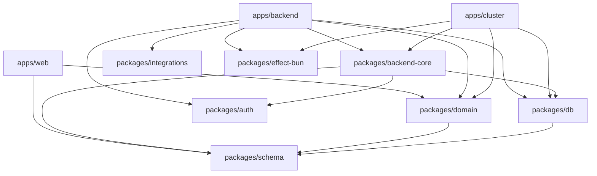

## Overview

Hazel Chat is organized as a **monorepo** using Bun workspaces and Turborepo for build orchestration. This structure enables code sharing, consistent tooling, and efficient builds across multiple applications and packages.

## Directory Structure

```
hazel-chat/
├── apps/                       # Applications
│   ├── web/                    # React web app (port 3000)
│   ├── backend/                # Effect-TS API server (port 3003)
│   ├── cluster/                # Distributed workflow service (port 3020)
│   ├── desktop/                # Tauri desktop app
│   ├── electric-proxy/         # Electric SQL auth proxy
│   └── link-preview-worker/    # Cloudflare Worker for link previews
│
├── packages/                   # Shared packages
│   ├── db/                     # Drizzle ORM schemas & migrations
│   ├── domain/                 # RPC contracts & cluster definitions
│   ├── backend-core/           # Reusable backend services
│   ├── schema/                 # Branded ID types
│   ├── auth/                   # Authentication utilities
│   ├── integrations/           # GitHub, Discord, etc.
│   ├── effect-bun/             # Effect platform for Bun
│   ├── rivet-effect/           # Rivet chat bridge
│   └── ui/                     # Shared React components
│
├── libs/                       # Internal libraries
│   └── effect-electric-db-collection/  # Electric SQL + TanStack DB bridge
│
├── bots/                       # Bot implementations
│   └── hazel-bot/              # Official Hazel bot
│
├── .context/                   # Library documentation
│   ├── effect/                 # Effect-TS examples
│   ├── effect-atom/            # Effect Atom patterns
│   └── tanstack-db/            # TanStack DB usage
│
├── turbo.json                  # Turborepo configuration
├── package.json                # Workspace root
└── bun.lock                    # Dependency lockfile
```

## Applications (`apps/`)

Each application is independently deployable but shares common packages.

### Web App (`apps/web/`)

The React frontend application.

```
apps/web/
├── src/
│   ├── routes/                 # TanStack Router file-based routes
│   ├── db/                     # Electric SQL collections
│   ├── lib/                    # Utilities and helpers
│   ├── components/             # React components
│   └── atoms/                  # Effect Atom state
├── public/                     # Static assets
├── package.json
└── vite.config.ts
```

<Info>
The web app uses **TanStack Router** for file-based routing. Each file in `routes/` becomes a route automatically.
</Info>

### Backend API (`apps/backend/`)

The Effect-TS API server handling business logic.

```
apps/backend/
├── src/
│   ├── routes/                 # HTTP API route handlers
│   ├── rpc/                    # RPC handler implementations
│   ├── services/               # Business logic services
│   ├── policies/               # Authorization policies
│   ├── lib/                    # Utilities
│   └── index.ts                # Server entrypoint
├── scripts/                    # Setup and seed scripts
└── package.json
```

**Key patterns:**
- Services use `Effect.Service` for dependency injection
- Policies implement row-level security
- RPC handlers map to domain contracts

### Cluster Service (`apps/cluster/`)

The distributed workflow execution service.

```
apps/cluster/
├── src/
│   ├── workflows/              # Workflow implementations
│   ├── cron/                   # Scheduled cron jobs
│   ├── services/               # Supporting services
│   └── index.ts                # Cluster server entrypoint
└── package.json
```

**Workflows:**
- Message notifications
- GitHub webhook processing
- File cleanup
- RSS feed polling
- AI thread naming

### Electric Proxy (`apps/electric-proxy/`)

Cloudflare Worker that enforces authorization for Electric SQL sync.

```
apps/electric-proxy/
├── src/
│   ├── tables/                 # Table access rules
│   ├── auth.ts                 # Authentication
│   └── index.ts                # Worker entrypoint
└── wrangler.toml
```

<Note>
When adding a new Electric-synced table, you **must** update both `ALLOWED_TABLES` and `getWhereClauseForTable` in the proxy.
</Note>

## Packages (`packages/`)

Shared code used across multiple applications.

### Database (`packages/db/`)

Central package for database schema and queries.

```typescript
// packages/db/src/
├── schema/                     // Drizzle table definitions
│   ├── users.ts
│   ├── messages.ts
│   ├── channels.ts
│   └── ...
├── index.ts                    // Database service
├── repositories.ts             // Repository pattern
└── README.md                   // Transaction docs
```

**Features:**
- Drizzle ORM with PostgreSQL
- Automatic transaction context propagation
- Policy-based authorization
- Type-safe queries

### Domain (`packages/domain/`)

Shared contracts and types between frontend and backend.

```typescript
// packages/domain/src/
├── rpc/                        // RPC contract definitions
│   ├── messages.ts             // Message operations
│   ├── channels.ts             // Channel operations
│   └── ...
├── cluster/                    // Cluster definitions
│   ├── workflows/              // Workflow schemas
│   ├── activities/             // Activity schemas
│   └── errors.ts               // Cluster errors
├── models/                     // Data models
├── http/                       // HTTP API definitions
└── errors.ts                   // Error schemas
```

<CardGroup cols={2}>
  <Card title="Why Domain Package?" icon="share-nodes">
    Ensures frontend and backend always agree on API contracts through shared TypeScript types.
  </Card>
  <Card title="Type Safety" icon="shield-check">
    Changes to RPC contracts are caught at compile-time, preventing runtime errors.
  </Card>
</CardGroup>

### Backend Core (`packages/backend-core/`)

Reusable backend services and repositories.

```typescript
// packages/backend-core/src/
├── repositories/               // Data access layer
│   ├── message-repo.ts
│   ├── channel-repo.ts
│   └── ...
├── services/                   // Business logic
│   ├── workos-client.ts
│   ├── workos-sync.ts
│   └── ...
└── index.ts
```

**Repositories** provide standard CRUD operations:
- `insert()`, `update()`, `deleteById()`
- `findById()`, `with()`
- Custom query methods

### Schema (`packages/schema/`)

Branded ID types for type safety.

```typescript
import type { OrganizationId, ChannelId, UserId } from "@hazel/schema"

// ✅ Type-safe - won't compile if wrong type
function getChannel(channelId: ChannelId) { ... }

// ❌ Wrong - use branded types instead
function getChannel(channelId: string) { ... }
```

Available types: `OrganizationId`, `ChannelId`, `UserId`, `MessageId`, `BotId`, and many more.

## Dependency Graph



<Info>
The `domain` and `schema` packages are foundational - they have minimal dependencies and are imported by both frontend and backend.
</Info>

## Turborepo Configuration

### Task Pipeline

Turborepo orchestrates build tasks across the monorepo:

```json
// turbo.json
{
  "tasks": {
    "build": {
      "outputs": ["dist/**", ".vercel/output/**"]
    },
    "typecheck": {
      "dependsOn": ["^typecheck"]
    },
    "dev": {
      "persistent": true,
      "cache": false
    }
  }
}
```

**Task types:**
- `build` - Compile TypeScript and bundle assets
- `typecheck` - Run TypeScript compiler without emitting
- `dev` - Start development server (persistent)
- `test` - Run unit and integration tests

### Running Tasks

```bash
# Run dev for all apps
bun run dev

# Run dev for specific app
bun run dev --filter=@hazel/web

# Run build for all packages
bun run build

# Run typecheck across monorepo
bun run typecheck
```

<Note>
Turborepo automatically determines which packages need to be built based on the dependency graph.
</Note>

## Workspace Configuration

### Bun Workspaces

```json
// package.json
{
  "workspaces": {
    "packages": [
      "apps/*",
      "packages/*",
      "libs/*",
      "bots/*"
    ],
    "catalogs": {
      "effect": {
        "effect": "3.19.19",
        "@effect/platform": "0.94.5",
        "@effect/rpc": "0.73.2",
        "@effect/cluster": "0.56.4",
        "@effect/workflow": "0.16.0"
      }
    }
  }
}
```

**Workspace catalogs** ensure consistent versions of Effect packages across all workspaces.

### Package Naming Convention

- `@hazel/*` - Internal packages (e.g., `@hazel/db`, `@hazel/domain`)
- Applications use descriptive names without scope

## Import Best Practices

### Use Correct Package Imports

```typescript
// ✅ Correct - Import from @hazel/schema
import type { OrganizationId, ChannelId } from "@hazel/schema"

// ✅ Correct - Import from @hazel/domain
import { Rpc, Cluster } from "@hazel/domain"
import { Message, Channel } from "@hazel/domain/models"

// ❌ Wrong - Don't import from @hazel/db in frontend
import { schema } from "@hazel/db"  // Backend only!
```

### Package Import Rules

<CardGroup cols={2}>
  <Card title="Frontend" icon="react">
    Can import: `@hazel/domain`, `@hazel/schema`, `@hazel/ui`
  </Card>
  <Card title="Backend" icon="server">
    Can import: All packages including `@hazel/db`, `@hazel/backend-core`
  </Card>
  <Card title="Domain" icon="share-nodes">
    Can import: Only `@hazel/schema` (minimal dependencies)
  </Card>
  <Card title="Schema" icon="fingerprint">
    No dependencies (foundational package)
  </Card>
</CardGroup>

## Adding New Packages

1. **Create package directory:**

```bash
mkdir -p packages/my-package/src
cd packages/my-package
```

2. **Create `package.json`:**

```json
{
  "name": "@hazel/my-package",
  "version": "0.0.0",
  "private": true,
  "type": "module",
  "exports": {
    ".": "./src/index.ts"
  },
  "dependencies": {}
}
```

3. **Create `src/index.ts`:**

```typescript
export * from "./my-module"
```

4. **Install dependencies:**

```bash
bun install
```

5. **Import in other packages:**

```typescript
import { MyFeature } from "@hazel/my-package"
```

## Build Output

### Development

In development, TypeScript files are executed directly by Bun (no build step needed).

### Production

For production, each app builds to a `dist/` directory:

```
apps/web/dist/           # Vite production build
apps/backend/dist/       # Compiled TypeScript
apps/cluster/dist/       # Compiled TypeScript
```

## Benefits of This Structure

<CardGroup cols={3}>
  <Card title="Code Sharing" icon="share">
    Shared packages eliminate duplication
  </Card>
  <Card title="Type Safety" icon="shield-check">
    TypeScript types shared between apps
  </Card>
  <Card title="Fast Builds" icon="bolt">
    Turborepo caches and parallelizes builds
  </Card>
  <Card title="Easy Refactoring" icon="wand-magic-sparkles">
    Changes propagate automatically
  </Card>
  <Card title="Consistent Tooling" icon="screwdriver-wrench">
    Same tools across all packages
  </Card>
  <Card title="Isolated Testing" icon="flask">
    Test packages independently
  </Card>
</CardGroup>

## Next Steps

<CardGroup cols={2}>
  <Card title="Effect-TS Patterns" icon="wand-magic-sparkles" href="/architecture/effect-ts">
    Learn about Effect-TS usage in the backend
  </Card>
  <Card title="Database Package" icon="database" href="/reference/database">
    Explore the database layer and transaction patterns
  </Card>
</CardGroup>