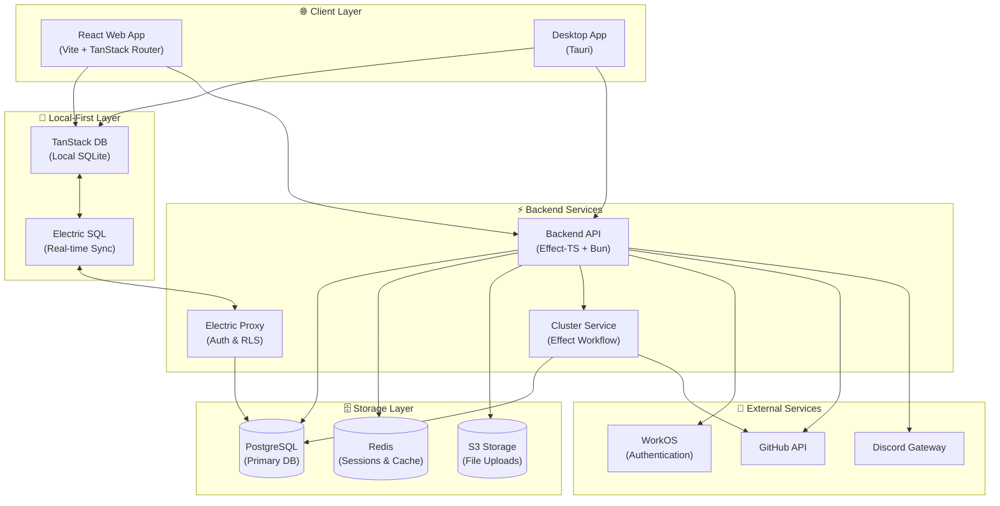

## System Architecture

Hazel Chat is a modern, real-time collaborative chat platform built with cutting-edge technologies that prioritize type safety, functional programming, and local-first architecture.

### Architecture Diagram

## Core Components

### Frontend (Web & Desktop)

The client applications provide the user interface for Hazel Chat:

- **Local-first data layer** using TanStack DB for offline support
- **Real-time sync** via Electric SQL for instant updates
- **Type-safe RPC calls** to the backend API
- **Reactive state management** with Effect Atom
- Built with **React 19**, **Vite**, and **TailwindCSS v4**

<Card title="Key Frontend Technologies" icon="react">
  - **React 19** with TypeScript for UI components
  - **TanStack Router** for file-based routing
  - **TanStack DB** for local SQLite database
  - **Electric SQL** for real-time sync
  - **Effect Atom** for reactive state
  - **Plate.js** for rich text editing
</Card>

### Backend API

The backend API handles business logic, authentication, and data persistence:

- Built with **Effect-TS** for functional programming patterns
- **Type-safe RPC system** using Effect RPC
- **Dependency injection** via Effect layers
- **Policy-based authorization** with row-level security
- Runs on **Bun runtime** for performance

<Info>
The backend uses Effect-TS extensively for error handling, dependency management, and resource lifecycle management.
</Info>

### Cluster Service

The cluster service provides distributed workflow execution:

- **Effect Cluster** for distributed systems coordination
- **Effect Workflow** for durable background jobs
- **PostgreSQL-backed persistence** for message storage
- **HTTP API** for workflow management

<CardGroup cols={2}>
  <Card title="Message Notifications" icon="bell">
    Creates notifications for new messages based on channel type and user mentions
  </Card>
  <Card title="GitHub Integration" icon="github">
    Processes GitHub webhooks and installation events
  </Card>
  <Card title="File Cleanup" icon="trash">
    Removes unused file uploads on schedule
  </Card>
  <Card title="RSS Polling" icon="rss">
    Fetches RSS feeds and posts updates to channels
  </Card>
</CardGroup>

### Electric SQL Proxy

The Electric proxy enforces authorization for real-time sync:

- **Row-level security** based on user permissions
- **WHERE clause injection** for organization and channel access
- **Table allowlisting** to prevent unauthorized sync
- Routes sync requests to Electric SQL service

## Data Flow

### Write Operations (Client → Server)

1. **User action** triggers RPC call from client
2. **Backend API** validates request and checks permissions
3. **Database write** occurs in PostgreSQL transaction
4. **Transaction ID** returned to client for optimistic updates
5. **Electric SQL** detects change and broadcasts to subscribers
6. **Cluster workflow** triggered for background processing (if needed)

### Read Operations (Server → Client)

1. **Electric SQL** streams data changes via HTTP long-polling
2. **Electric Proxy** injects WHERE clauses based on user auth
3. **TanStack DB** receives updates and stores in local SQLite
4. **React components** re-render with new data via Effect Atom

<Note>
Optimistic updates allow the UI to respond instantly while the server processes the request in the background.
</Note>

## Technology Stack

### Frontend Stack

| Technology | Purpose |
|------------|----------|
| React 19 | UI framework with concurrent rendering |
| TypeScript | Type safety and developer experience |
| Vite | Fast development server and builds |
| TanStack Router | File-based routing with type safety |
| TanStack DB | Local-first SQLite database |
| Electric SQL | Real-time sync with PostgreSQL |
| Effect Atom | Reactive state management |
| TailwindCSS v4 | Utility-first styling |
| React Aria | Accessible UI components |
| Plate.js | Rich text editor framework |

### Backend Stack

| Technology | Purpose |
|------------|----------|
| Bun | JavaScript runtime (faster than Node.js) |
| Effect-TS | Functional programming framework |
| Effect RPC | Type-safe client-server communication |
| Effect Cluster | Distributed systems coordination |
| Effect Workflow | Durable workflow execution |
| Drizzle ORM | Type-safe database queries |
| PostgreSQL | Primary relational database |
| Redis | Session storage and caching |
| WorkOS | Authentication and SSO |

### Development Tools

| Tool | Purpose |
|------|----------|
| Turborepo | Monorepo build orchestration |
| OXC | Fast linting and formatting |
| Vitest | Unit and integration testing |
| Drizzle Kit | Database migration management |

## Key Architectural Decisions

### Local-First Architecture

Hazel Chat uses a **local-first** approach where data is stored locally in TanStack DB and synced with the server via Electric SQL. This provides:

- **Instant UI updates** with optimistic rendering
- **Offline support** with automatic sync when reconnected
- **Reduced server load** by handling reads locally
- **Better user experience** with no loading spinners

### Effect-TS for Backend

Effect-TS provides functional programming patterns that make the backend code:

- **Type-safe** with compile-time guarantees
- **Composable** with small, reusable functions
- **Testable** via dependency injection
- **Resilient** with built-in error handling and retry logic

### Distributed Workflows

Effect Cluster and Effect Workflow handle background jobs with:

- **Durability** - workflows survive restarts
- **Idempotency** - safe to retry operations
- **Observability** - structured logging and tracing
- **Scalability** - distributed across multiple nodes

## Port Assignments

| Service | Port | Description |
|---------|------|-------------|
| Web App | 3000 | React frontend development server |
| Backend API | 3003 | Effect-TS API server |
| Cluster Service | 3020 | Distributed workflow service |
| PostgreSQL | 5432 | Primary database |
| Redis | 6379 | Session cache |
| Electric SQL | 3002 | Real-time sync service |
| MinIO (S3) | 9000 | Local object storage |

<Info>
All services communicate over HTTP/HTTPS. The backend uses RPC over HTTP for client-server communication.
</Info>

## Next Steps

<CardGroup cols={2}>
  <Card title="Monorepo Structure" icon="folder-tree" href="/architecture/monorepo-structure">
    Learn about the monorepo organization and package dependencies
  </Card>
  <Card title="Effect-TS Patterns" icon="wand-magic-sparkles" href="/architecture/effect-ts">
    Explore Effect-TS usage and functional programming patterns
  </Card>
  <Card title="Electric SQL" icon="bolt" href="/architecture/electric-sql">
    Understand the local-first sync architecture
  </Card>
  <Card title="RPC System" icon="code" href="/architecture/rpc-system">
    Dive into the type-safe RPC system
  </Card>
</CardGroup>