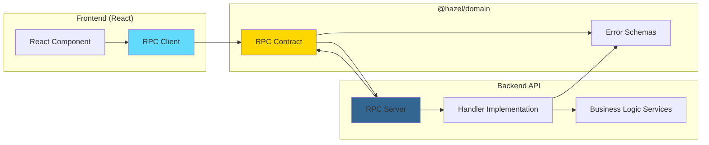

## Overview

Hazel Chat uses **Effect RPC** for type-safe client-server communication. The RPC system provides:

- **Full type inference** across the network boundary
- **Shared contracts** between frontend and backend
- **Automatic serialization** of complex types
- **Type-safe error handling** with typed errors
- **Middleware support** for authentication and validation

<Info>
RPC (Remote Procedure Call) allows the frontend to call backend functions as if they were local, with full TypeScript type safety.
</Info>

## Architecture



## Contract Definition

RPC contracts are defined in `packages/domain/src/rpc/` and shared between frontend and backend.

### Basic RPC Contract

```typescript
// packages/domain/src/rpc/messages.ts
import { Rpc, RpcGroup } from "@effect/rpc"
import { Schema } from "effect"
import { Message } from "../models"
import { MessageId, TransactionId } from "@hazel/schema"
import {
  MessageNotFoundError,
  UnauthorizedError,
  InternalServerError,
} from "../errors"
import { RateLimitExceededError } from "../rate-limit-errors"
import { AuthMiddleware } from "./middleware"

// Response schema
export class MessageResponse extends Schema.Class<MessageResponse>("MessageResponse")({
  data: Message.Model.json,
  transactionId: TransactionId,
}) {}

// RPC group with all message operations
export class MessageRpcs extends RpcGroup.make(
  // Create message
  Rpc.make("message.create", {
    payload: Message.Insert,
    success: MessageResponse,
    error: Schema.Union(
      ChannelNotFoundError,
      UnauthorizedError,
      InternalServerError,
      RateLimitExceededError,
    ),
  }).middleware(AuthMiddleware),
  
  // Update message
  Rpc.make("message.update", {
    payload: Schema.Struct({
      id: MessageId,
    }).pipe(Schema.extend(Message.JsonUpdate)),
    success: MessageResponse,
    error: Schema.Union(
      MessageNotFoundError,
      UnauthorizedError,
      InternalServerError,
      RateLimitExceededError,
    ),
  }).middleware(AuthMiddleware),
  
  // Delete message
  Rpc.make("message.delete", {
    payload: Schema.Struct({ id: MessageId }),
    success: Schema.Struct({ transactionId: TransactionId }),
    error: Schema.Union(
      MessageNotFoundError,
      UnauthorizedError,
      InternalServerError,
      RateLimitExceededError,
    ),
  }).middleware(AuthMiddleware),
) {}
```

**Key components:**
- `Rpc.make(name, schema)` - Defines a single RPC method
- `payload` - Input schema (validated automatically)
- `success` - Success response schema
- `error` - Union of possible error types
- `middleware()` - Apply authentication/validation

### RPC Groups

Group related operations together:

```typescript
// packages/domain/src/rpc/index.ts
export * from "./messages"
export * as Messages from "./messages"
export * from "./channels"
export * as Channels from "./channels"
export * from "./users"
export * as Users from "./users"

// Export all RPC groups
import { MessageRpcs } from "./messages"
import { ChannelRpcs } from "./channels"
import { UserRpcs } from "./users"

export const AllRpcs = RpcGroup.union(MessageRpcs, ChannelRpcs, UserRpcs)
```

<CardGroup cols={2}>
  <Card title="Type Safety" icon="shield-check">
    Contracts are shared - frontend and backend always agree on types
  </Card>
  <Card title="Versioning" icon="code-branch">
    Change a contract and TypeScript catches all call sites
  </Card>
</CardGroup>

## Backend Implementation

### RPC Handler

Implement the contract on the backend:

```typescript
// apps/backend/src/rpc/messages.ts
import { Rpc } from "@effect/rpc"
import { Effect } from "effect"
import { MessageRpcs } from "@hazel/domain/rpc"
import { MessageRepo, ChannelRepo } from "@hazel/backend-core"
import { MessagePolicy } from "../policies/message-policy"
import { policyUse } from "@hazel/backend-core"
import { CurrentUser } from "@hazel/domain"
import { generateTransactionId } from "@hazel/db"

export const messageCreateHandler = Rpc.effect(
  MessageRpcs.messageCreate,
  (payload) =>
    Effect.gen(function* () {
      const messageRepo = yield* MessageRepo
      const channelRepo = yield* ChannelRepo
      const currentUser = yield* CurrentUser
      const db = yield* Database
      
      // Verify channel exists
      const channel = yield* channelRepo.findById(payload.channelId)
      if (Option.isNone(channel)) {
        return yield* Effect.fail(new ChannelNotFoundError({ 
          channelId: payload.channelId 
        }))
      }
      
      // Create message in transaction with policy check
      return yield* db.transaction(
        Effect.gen(function* () {
          const message = yield* messageRepo.insert({
            ...payload,
            authorId: currentUser.id,
          }).pipe(
            policyUse(MessagePolicy.canCreate(payload.channelId)),
          )
          
          const txId = yield* generateTransactionId()
          
          return { data: message, transactionId: txId }
        }),
      )
    }),
)

export const messageUpdateHandler = Rpc.effect(
  MessageRpcs.messageUpdate,
  (payload) =>
    Effect.gen(function* () {
      const messageRepo = yield* MessageRepo
      const currentUser = yield* CurrentUser
      const db = yield* Database
      
      return yield* db.transaction(
        Effect.gen(function* () {
          // Check message exists and user can update
          const message = yield* messageRepo.with(payload.id, (msg) =>
            Effect.gen(function* () {
              if (msg.authorId !== currentUser.id) {
                return yield* Effect.fail(new UnauthorizedError())
              }
              return msg
            }),
          )
          
          // Update message
          const updated = yield* messageRepo.update({
            id: payload.id,
            ...payload,
          })
          
          const txId = yield* generateTransactionId()
          
          return { data: updated, transactionId: txId }
        }),
      )
    }),
)

export const messageDeleteHandler = Rpc.effect(
  MessageRpcs.messageDelete,
  (payload) =>
    Effect.gen(function* () {
      const messageRepo = yield* MessageRepo
      const currentUser = yield* CurrentUser
      const db = yield* Database
      
      return yield* db.transaction(
        Effect.gen(function* () {
          // Soft delete message
          yield* messageRepo.deleteById(payload.id)
          
          const txId = yield* generateTransactionId()
          
          return { transactionId: txId }
        }),
      )
    }),
)
```

### RPC Server Setup

```typescript
// apps/backend/src/rpc/server.ts
import { RpcServer } from "@effect/rpc"
import { Layer } from "effect"
import { AllRpcs } from "@hazel/domain/rpc"
import {
  messageCreateHandler,
  messageUpdateHandler,
  messageDeleteHandler,
} from "./messages"

// Combine all handlers
export const RpcServerLive = RpcServer.layer({
  handlers: RpcGroup.handlers(AllRpcs, {
    "message.create": messageCreateHandler,
    "message.update": messageUpdateHandler,
    "message.delete": messageDeleteHandler,
    // ... more handlers
  }),
})

// Mount RPC endpoint
export const RpcRoute = RpcServer.layerHttpRouter({
  group: AllRpcs,
  path: "/rpc",
  protocol: "http",
}).pipe(
  Layer.provide(RpcSerialization.layerNdjson),
  Layer.provide(RpcServerLive),
)
```

## Frontend Usage

### RPC Client Setup

```typescript
// apps/web/src/lib/rpc-client.ts
import { RpcClient } from "@effect/rpc"
import { HttpClient } from "@effect/platform"
import { AllRpcs } from "@hazel/domain/rpc"
import { Effect, Layer } from "effect"

const backendUrl = import.meta.env.VITE_BACKEND_URL

export const RpcClientLive = Layer.unwrapEffect(
  Effect.gen(function* () {
    const httpClient = yield* HttpClient.HttpClient
    
    return RpcClient.layer({
      group: AllRpcs,
      http: httpClient.pipe(
        HttpClient.mapRequest(
          HttpClientRequest.prependUrl(`${backendUrl}/rpc`),
        ),
      ),
    })
  }),
)
```

### Calling RPCs from React

```typescript
// apps/web/src/components/MessageComposer.tsx
import { useCallback } from "react"
import { Atom } from "@effect-atom/atom-react"
import { RpcClient } from "~/lib/rpc-client"
import { Effect } from "effect"

const sendMessageAtom = Atom.fn((content: string) =>
  Atom.gen(function* (ctx) {
    const rpc = yield* RpcClient
    const channelId = yield* ctx.get(currentChannelAtom)
    
    // Call RPC method with full type safety
    const result = yield* rpc.messageCreate({
      channelId,
      content,
      attachmentIds: [],
    })
    
    return result
  }),
)

function MessageComposer() {
  const sendMessage = useAtomCallback(sendMessageAtom)
  
  const handleSubmit = useCallback(
    async (content: string) => {
      try {
        const result = await sendMessage(content)
        console.log("Message sent:", result.data)
      } catch (error) {
        // Errors are typed!
        if (error._tag === "RateLimitExceededError") {
          toast.error("You're sending messages too fast")
        } else if (error._tag === "UnauthorizedError") {
          toast.error("You don't have permission to send messages")
        } else {
          toast.error("Failed to send message")
        }
      }
    },
    [sendMessage],
  )
  
  return <MessageInput onSubmit={handleSubmit} />
}
```

<Info>
Notice how the RPC call looks like a regular function call, but it's actually making a network request with full type safety!
</Info>

## Authentication Middleware

### Defining Middleware

```typescript
// packages/domain/src/rpc/middleware.ts
import { Rpc } from "@effect/rpc"
import { CurrentUser } from "../current-user"

export const AuthMiddleware = Rpc.middlewareEffect((payload) =>
  Effect.gen(function* () {
    // CurrentUser service provides authenticated user
    const user = yield* CurrentUser
    
    // User is now available in handler via CurrentUser service
    return payload
  }),
)
```

### Using Middleware

```typescript
// Apply middleware to RPC
Rpc.make("message.create", {
  payload: Message.Insert,
  success: MessageResponse,
  error: MessageErrors,
}).middleware(AuthMiddleware)  // Requires authentication
```

### Current User Service

```typescript
// packages/domain/src/current-user.ts
import { Context, Effect } from "effect"
import type { UserId } from "@hazel/schema"

export interface CurrentUserService {
  readonly id: UserId
  readonly email: string
  readonly name: string
}

export class CurrentUser extends Context.Tag("CurrentUser")<
  CurrentUser,
  CurrentUserService
>() {
  // Authorization middleware implementation
  static Authorization = Context.Tag<
    CurrentUser.Authorization,
    {
      bearer: (token: Redacted.Redacted) => Effect.Effect<CurrentUserService, UnauthorizedError>
    }
  >()
}
```

## Error Handling

### Defining RPC Errors

```typescript
// packages/domain/src/errors.ts
import { Schema } from "effect"

export class MessageNotFoundError extends Schema.TaggedError<MessageNotFoundError>()("MessageNotFoundError", {
  messageId: Schema.String,
  message: Schema.String.pipe(Schema.withDefault(() => "Message not found")),
}) {}

export class UnauthorizedError extends Schema.TaggedError<UnauthorizedError>()("UnauthorizedError", {
  message: Schema.String.pipe(Schema.withDefault(() => "Unauthorized")),
}) {}

export class RateLimitExceededError extends Schema.TaggedError<RateLimitExceededError>()("RateLimitExceededError", {
  retryAfter: Schema.Number,
  message: Schema.String,
}) {}
```

### Handling Errors in Frontend

```typescript
import { Effect } from "effect"
import { RpcClient } from "~/lib/rpc-client"

const getMessage = (messageId: MessageId) =>
  Effect.gen(function* () {
    const rpc = yield* RpcClient
    
    return yield* rpc.messageGet({ id: messageId }).pipe(
      Effect.catchTag("MessageNotFoundError", (error) =>
        Effect.succeed(null)  // Return null if not found
      ),
      Effect.catchTag("UnauthorizedError", (error) =>
        Effect.fail(new Error("Access denied"))  // Convert to generic error
      ),
    )
  })
```

<CardGroup cols={2}>
  <Card title="Typed Errors" icon="shield-halved">
    All errors are typed - TypeScript knows what can fail
  </Card>
  <Card title="Exhaustive Handling" icon="list-check">
    TypeScript ensures you handle all possible errors
  </Card>
</CardGroup>

## Rate Limiting

### Backend Rate Limiter

```typescript
// apps/backend/src/services/rate-limiter.ts
import { Effect } from "effect"
import { Redis } from "@hazel/effect-bun"
import { RateLimitExceededError } from "@hazel/domain"

export class RateLimiter extends Effect.Service<RateLimiter>()("RateLimiter", {
  accessors: true,
  dependencies: [Redis.Default],
  effect: Effect.gen(function* () {
    const redis = yield* Redis
    
    const checkLimit = (key: string, limit: number, windowSeconds: number) =>
      Effect.gen(function* () {
        const count = yield* redis.incr(key)
        
        if (count === 1) {
          yield* redis.expire(key, windowSeconds)
        }
        
        if (count > limit) {
          return yield* Effect.fail(
            new RateLimitExceededError({
              retryAfter: windowSeconds,
              message: `Rate limit exceeded. Try again in ${windowSeconds}s`,
            }),
          )
        }
        
        return count
      })
    
    return { checkLimit }
  }),
}) {}
```

### Using in RPC Handler

```typescript
export const messageCreateHandler = Rpc.effect(
  MessageRpcs.messageCreate,
  (payload) =>
    Effect.gen(function* () {
      const rateLimiter = yield* RateLimiter
      const currentUser = yield* CurrentUser
      
      // Check rate limit: 60 messages per minute
      yield* rateLimiter.checkLimit(
        `message:create:${currentUser.id}`,
        60,
        60,
      )
      
      // ... rest of handler
    }),
)
```

## Best Practices

<CardGroup cols={2}>
  <Card title="Use RpcGroup" icon="layer-group">
    Group related operations for better organization
  </Card>
  <Card title="Typed Errors" icon="triangle-exclamation">
    Always define specific error types for different failure modes
  </Card>
  <Card title="Middleware" icon="filter">
    Use middleware for cross-cutting concerns like auth and logging
  </Card>
  <Card title="Transaction IDs" icon="fingerprint">
    Return transaction IDs for optimistic updates
  </Card>
  <Card title="Validation" icon="check-circle">
    Use Effect Schema for automatic payload validation
  </Card>
  <Card title="Rate Limiting" icon="gauge-high">
    Apply rate limits to prevent abuse
  </Card>
</CardGroup>

## RPC vs HTTP API

Hazel Chat uses both RPC and HTTP APIs:

| Use Case | Approach | Example |
|----------|----------|----------|
| Frontend ↔ Backend | RPC | Message operations |
| Backend ↔ Cluster | RPC | Workflow execution |
| External integrations | HTTP API | Webhooks from GitHub |
| Health checks | HTTP API | `/health` endpoint |

<Note>
RPC is preferred for internal communication where both sides are TypeScript. HTTP API is used for external integrations.
</Note>

## Next Steps

<CardGroup cols={2}>
  <Card title="Cluster Workflows" icon="sitemap" href="/architecture/cluster-workflows">
    Learn about distributed workflows using RPC
  </Card>
  <Card title="Effect-TS Patterns" icon="wand-magic-sparkles" href="/architecture/effect-ts">
    Explore more Effect-TS patterns
  </Card>
</CardGroup>